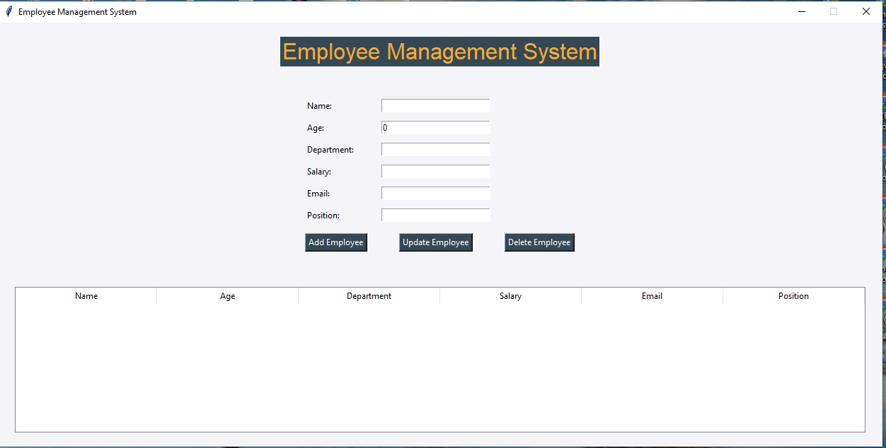
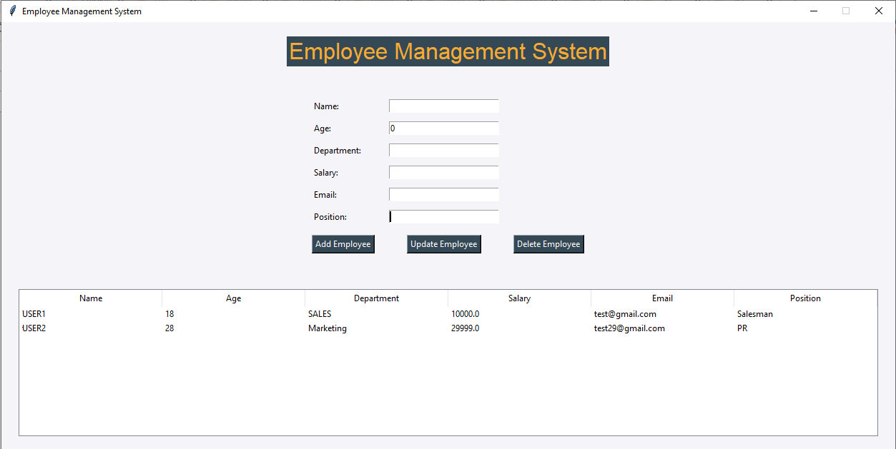

# Employee Management System

A simple Employee Management System built with **Python and Tkinter**.

I created this project while learning Python to practice GUI development, classes, functions, and basic CRUD operations.

## Features

* Add employee
* Update employee
* Delete employee
* View employee records
* Salary validation
* Unique employee ID

## Technologies Used

* Python
* Tkinter
* Jupyter Notebook

## What I Learned

* Creating GUI applications with Tkinter
* Using Python classes and objects
* Working with functions and events
* Using lists and dictionaries
* Basic input validation
* Implementing CRUD operations
* Using UUID for unique IDs

## Screenshots

### Dashboard

### Employee Added

## How to Run

1. Download or clone this repository.
2. Open `employee_management_system.py`.
3. Run the Python file.

## Note

This is a learning project. Employee data is stored temporarily in memory and will be lost when the application is closed.

## Future Improvements

* Add a database
* Add employee search
* Improve input validation
* Improve GUI design
* Add login functionality

